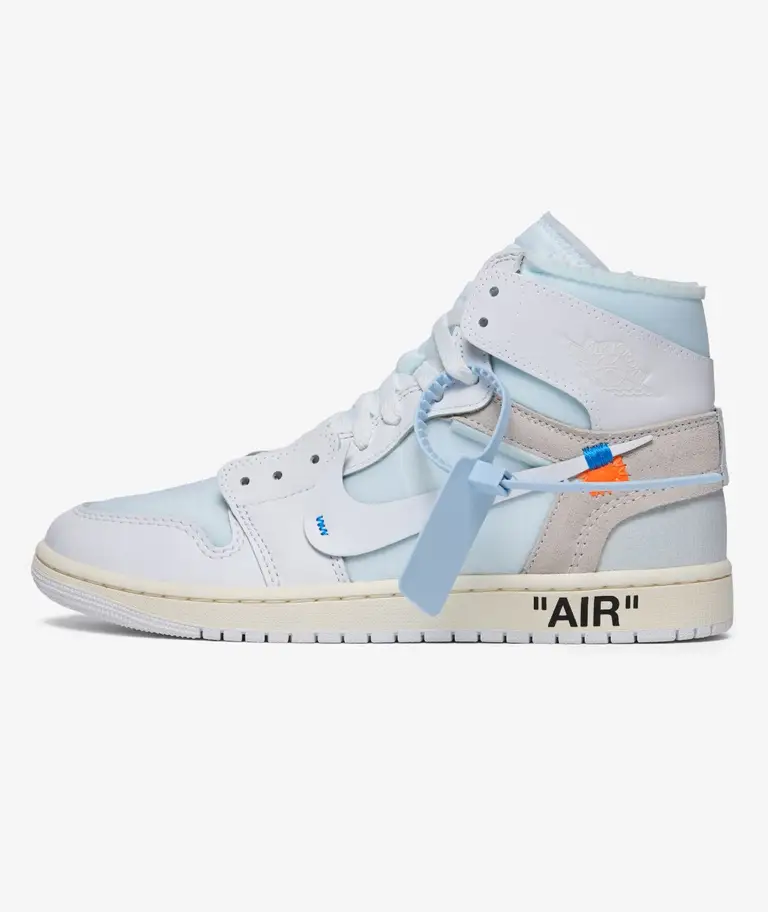

# Acid Sneaks - Sneaker E-Commerce Website


## 📱 À propos du projet

**Acid Sneaks** est un site e-commerce spécialisé dans la vente de sneakers exclusives et collaboratives. Le site propose une large sélection de paires recherchées, incluant des Air Jordan, Nike Air Max, Adidas et New Balance.

### Page Produit



*Air Jordan 1 Retro High x Travis Scott "Reverse Mocha" - 195€*

## 🎯 Fonctionnalités

- ✅ **Catalogue de sneakers** - Plus de 12 paires différentes
- ✅ **Pages produit dynamiques** - Affichage des détails, prix et images
- ✅ **Galerie d'images** - Visualisation complète des sneakers
- ✅ **Navigation fluide** - Menu responsive et intuitif
- ✅ **Panier d'achat** - Gestion des articles sélectionnés
- ✅ **Système de login/inscription** - Authentification utilisateur
- ✅ **Footer informatif** - Liens et informations de contact

## 🏗️ Structure du projet

```
Sneaker-website/
├── index.html              # Page d'accueil
├── css/
│   └── style.css          # Feuille de styles principale
├── js/
│   └── acid.js            # Logique JavaScript (panier, navigation, produits)
├── pages/
│   ├── sneakers.html      # Catalogue complet des sneakers
│   ├── product.html       # Page détail produit
│   ├── login.html         # Page de connexion/inscription
│   └── shoppingcart.html  # Panier d'achat
├── data/
│   └── data.json          # Base de données des produits
└── images/
    ├── Shoes/             # Images des sneakers
    └── [autres assets]    # Logos, icônes, etc.
```

## 📦 Produits disponibles

### Nike
- Air Jordan 5 Retro x Off-White (225€)
- Air Jordan 1 x Union (210€)
- Air Jordan 1 "Reverse Mocha" (195€)
- Air Jordan 3 "Seoul" (185€)
- Air Jordan 4 SB (200€)
- Air Jordan 4 "Bred" (195€)
- Air Jordan 6 "Infrared" (205€)
- Air Max Plus 7 (165€)
- Air Max 95 Neon (175€)

### Adidas
- Predator x Bape (220€)
- Campus Bad Bunny (145€)

### New Balance
- New Balance 990v4 (210€)

## 🛠️ Technologies utilisées

- **HTML5** - Structure et markup
- **CSS3** - Styling et design responsive
- **JavaScript (Vanilla)** - Interactivité et gestion du DOM
- **JSON** - Stockage des données produits

## 🚀 Installation et utilisation

1. **Cloner le projet** ou télécharger les fichiers
2. **Ouvrir `index.html`** dans un navigateur web
3. **Naviguer** à travers les pages avec le menu principal
4. **Consulter les produits** en cliquant sur les sneakers
5. **Ajouter au panier** depuis les pages produit

## 📄 Pages principales

### 🏠 Page d'accueil (`index.html`)
- Section hero avec produit en avant
- Produits populaires
- Produits récents (dernières sneakers ajoutées)
- Section promotionnelle

### 👟 Catalogue (`pages/sneakers.html`)
- Grille de 12 produits
- Filtres de tri disponibles
- Liens directs vers les pages produit

### 📝 Détail produit (`pages/product.html`)
- Images multiples avec galerie interactive
- Informations complètes (marque, titre, prix, description)
- Bouton d'ajout au panier
- Affichage dynamique basé sur l'ID du produit

### 🛒 Panier (`pages/shoppingcart.html`)
- Gestion des articles
- Calcul automatique du total
- Ajustement des quantités

### 🔐 Authentification (`pages/login.html`)
- Connexion utilisateur
- Inscription nouveau compte

## 💾 Format des données (data.json)

```json
{
    "jordan5": {
        "brand": "Nike",
        "title": "Air Jordan 5 Retro x Off-White",
        "price": "225,00 €",
        "images": ["../images/jordan5off.jpg", "..."],
        "description": "Description détaillée du produit..."
    }
}
```

## 🎨 Personnalisation

- **Couleurs et fonts** : Modifier `css/style.css`
- **Ajouter des produits** : Ajouter des entrées dans `data/data.json` et mettre à jour les pages HTML
- **Images** : Placer les images dans `images/Shoes/` et référencer dans le JSON

## 📱 Responsive Design

Le site est conçu pour être responsive et fonctionner sur :
- 📱 Téléphones mobiles
- 📱 Tablettes
- 💻 Ordinateurs de bureau

## 👨‍💻 Auteur

**Projet créé en 2022** - Acid Sneaks E-Commerce

---

**Note** : Ce projet est à titre démonstratif et montre les capacités en développement front-end.